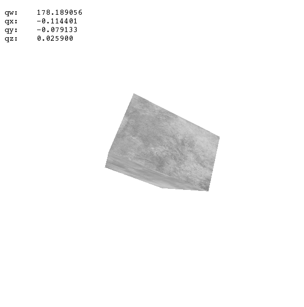
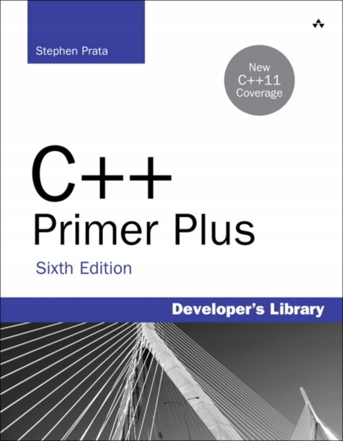

# C/C++ stuff

## Recent projects

- **Gravity** - experiments with gravity and forces. [Youtube video](https://www.youtube.com/watch?v=3KXJqj0l5hY).

  Requires SFML 2.

- **Angle visualization** - a small program which visualizes quaternion rotations in real time. It waits for a stream of floating point numbers on *stdin*. Each group of 4 floats represents a single quaternion (*qw, qx, qy, qz*). The program creates an additional thread which renders OpenGL window with a box, which will be rotated if new input is received. 

  Requires SFML 2. 



- **IO Benchmark**:
  ```
  1) scanf:                                   648147us
  2) out-of-the-box cin:                      2640799us
  3) getline:                                 1873624us
  4) sync_with_stdio(false) cin:              1519344us
  5) sync_with_stdio(false) + cin.tie(0) cin: 1468933us
  ```

## Old projects

C++ was the first programming language which I started to learn. I uploaded here some of my old projects and exercises which survived on my computer. I think most of them were created in 2016-2018. A few were also reviewed and fixed by me later.

- **Stephen Prata - C++ Primer Plus [Polish Edition]** - my completed exercises and examples from the book.

  

  

- **Command line** projects:
  
  - *Self-playing checkers*,
  - *Roguelike cave generator*,
  - *Mathematic clock*,
  - *Sokoban*,
  - miscellaneous (coloring console, arrows support, GUIs),
  
- **SFML** projects:
  - *Snake*,
  - *Not Only Circles* - renders circle from 1px height image,
  
- **Allegro** projects:
  - *Astro*,
  - *Left Side Attack*,
  - miscellaneous (user input, rendering primitives)
  
- miscellaneous:
  - *Higher lower*,
  - *Name generator*,
  - *Temperature converter*.

### Gallery

<p align="center">
  
  
  
  
  
  
  
  
</p>
