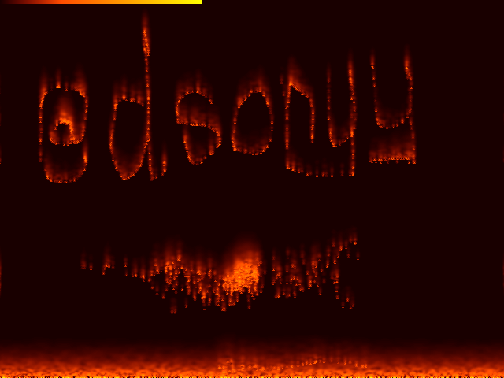
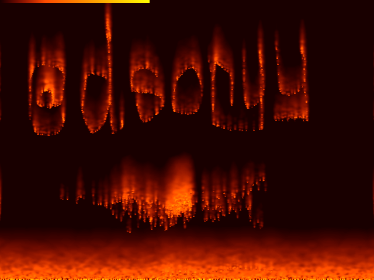
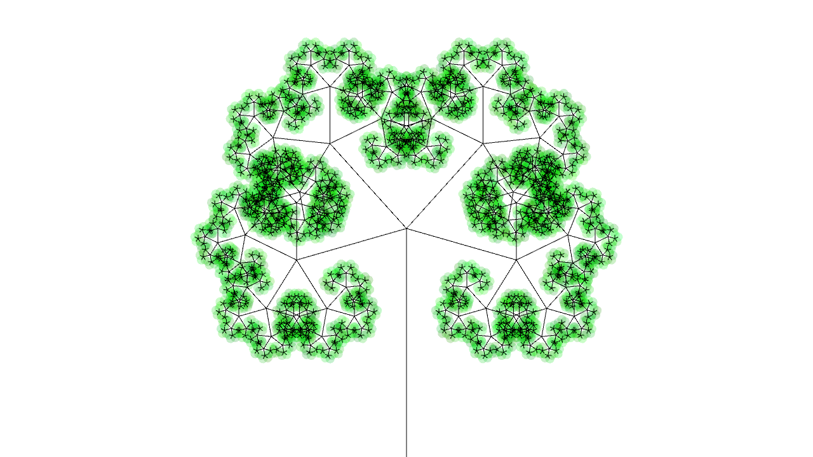
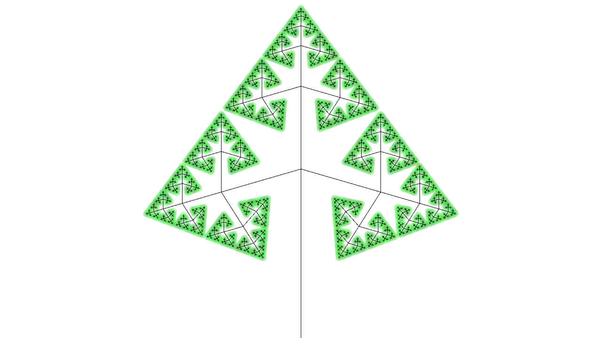
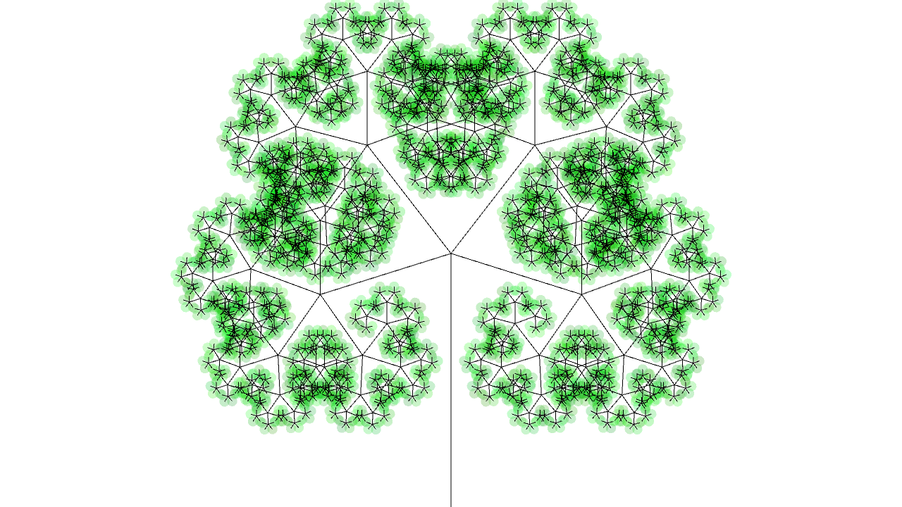

# C/C++ stuff

## Recent projects

- **Fire** - Oldskool fire effect in SFML:

   

- **Fractal Trees** - just playing with fractals, recursion and SFML:

  

- **Gravity** - experiments with gravity and forces. [Youtube video](https://www.youtube.com/watch?v=3KXJqj0l5hY). Collisions are not implemented because I'm too lazy.

  Requires SFML 2.

- **Angle visualization** - a small program which visualizes quaternion rotations in real time. It waits for a stream of floating point numbers on _stdin_. Each group of 4 floats represents a single quaternion (_qw, qx, qy, qz_). The program creates an additional thread which renders OpenGL window with a box, which will be rotated if new input is received.

  Requires SFML 2.

  

- **IO Benchmark** - results:

  ```
  1) scanf:                                   648147us
  2) out-of-the-box cin:                      2640799us
  3) getline:                                 1873624us
  4) sync_with_stdio(false) cin:              1519344us
  5) sync_with_stdio(false) + cin.tie(0) cin: 1468933us
  ```

- **Yet Another Sokoban** - can be found in `sokoban` directory.

## Old projects

C++ was the first programming language which I started to learn. I uploaded here some of my old projects and exercises which survived on my computer. I think most of them were created in 2016-2018. A few were also reviewed and fixed by me later.

- **Stephen Prata - C++ Primer Plus [Polish Edition]** - my completed exercises and examples from the book.

  

- **Command line** projects:

  - _Self-playing checkers_,
  - _Roguelike cave generator_,  
    
  - _Mathematic clock_,  
    
  - _Sokoban_,
  - miscellaneous (coloring console, arrows support, GUIs),
  -   
      
      
      
      
      
      
  - _Ent simulator_ - an unfinished game where you are a tree,  
    
  - _Hellmine_ - an unfinished roguelike game,  
    
  - _Fireworks_ - an unfinished game where you need to click on the fireworks,  
    
  - _Spider_ - an unfinished game where you are a spider and need to eat flies,  
    
  - Yet another unfinished game:  
      
    
    

- **SFML** projects:
  - _Snake_,
  - _Not Only Circles_ - renders circle from 1px height image,  
    
    
    
- **Allegro** projects:
  - _Astro_,  
    
  - _Left Side Attack_,  
    
  - miscellaneous (user input, rendering primitives)
- miscellaneous:
  - _Higher lower_,  
    
  - _Name generator_,  
    
  - _Temperature converter_.  
    
